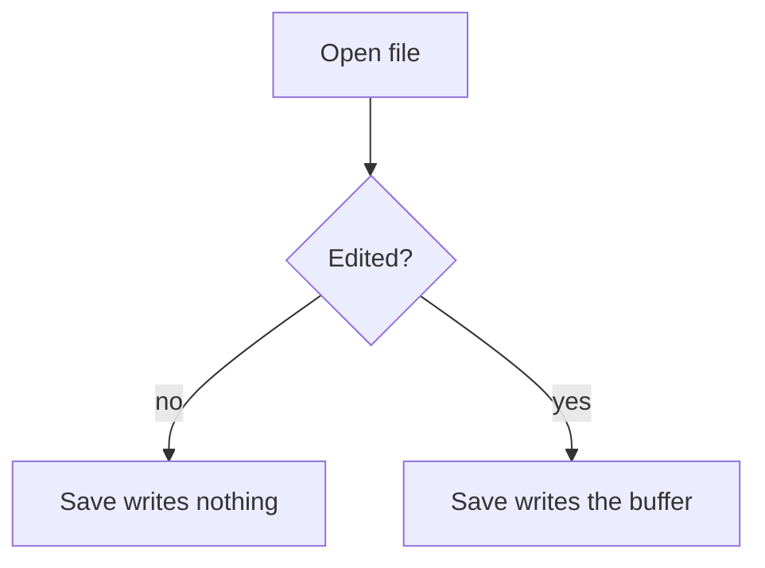

# Flow

Before the diagram.

```mermaid
graph TD
  A[Open file] --> B{Edited?}
  B -->|no| C[Save writes nothing]
  B -->|yes| D[Save writes the buffer]
```

~~~mermaid
sequenceDiagram
  User->>Editor: type
  Editor->>Host: POST /fs/write
~~~

After the diagrams.
